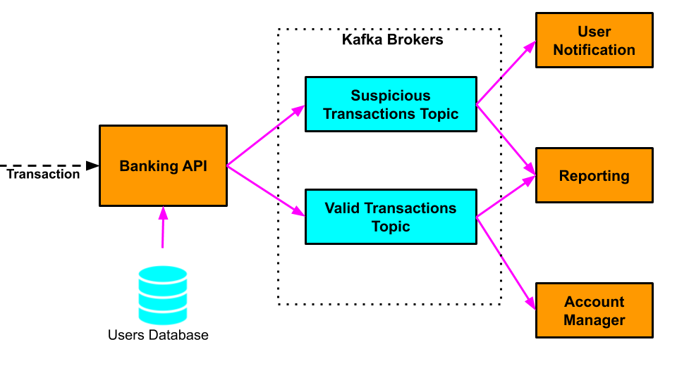
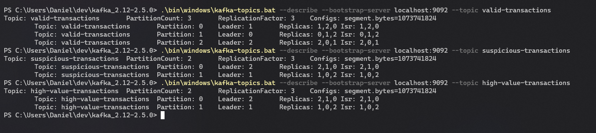

# Kafka Distributed Banking System

Y4S1 Distributed Systems Apache Kafka Assignment.

## Introduction

A distributed banking system made up of several micro-services communicating via Kafka. The system processes customer card transactions and identifies suspicious transactions so that customers can be notified. Transactions are identified as being suspicious if the location of the transaction is different from the customer's location.

## Architecture

The distributed banking system is made up of the following micro-services:

- **Banking API Service**: This is the entry point to the system. It receives customer card transactions from retailers and produces messages to the appropriate Kafka topics for processing by the other services. In a real system this would receive transactions from a front-end GUI application or another banking system. In this simplified version it reads customer transactions from a text file.

  - Each `Transaction` contains the following information:
    - _User_: the username of the user who made the purchase in that particular store.
    - _Amount_: the amount of the purchase transaction.
    - _Transaction Location_: the country in which the purchase transactions took place.

- **Customers Database**: A database where we store each of our bank customers' home locations. In a real system this would connect to a real database. In this simplified version it reads customer address information from a text file.

- **User Notification Service**: Receives notifications of suspicious transactions that require customer approval.

- **Account Manager Service**: Receives notifications of valid transactions which can be processed normally (debit money from the customer's account to the stores account).

- **Reporting Service**: Receives notifications of all transactions received by the Banking API Service for further processing.

- **High Value Service**: Receives notifications of high-value transactions.

All the communication between these micro-services is achieved using Kafka Topics.

## Kafka Cluster Setup

The system communicates using a fault-tolerant and scalable Kafka cluster set up as follows:

- 3 Kafka brokers listening on ports 9092, 9093 and 9094.
- A topic called `valid-transactions` with 3 partitions and a replication factor of 3.
- A topic called `suspicious-transactions` with 2 partitions and a replication factor of 3.
- A topic called `high-value-transactions` with 2 partitions and a replication factor of 3.

When set up correctly, the output of the `kafka-topics` script's `--describe` command for the two topics should look something like this:

## Implementation of the Distributed Banking System Micro-Services

- `bank-api-service` - Processes customer transactions from a text file. Processing transactions involves:
  - Identifying the customer the transaction applies to using the `user` field of `Transaction`.
  - Retrieving this customer's home address from the `CustomerAddressDatabase`.
  - Compare the transaction location with the customer's home address, and send a message to the
    appropriate Kafka topic:
    - If the locations match then it's a valid transaction and the message should be sent to the `valid-transactions` topic.
    - If the locations don't match then it's a suspicious transaction and the message should be sent to the `suspicious-transactions` topic.
    - The Kafka messages should have the following structure:
      - **Key**: user (_String_).
      - **Value**: Transaction.

- `user-notification-service` - Receives Kafka messages with information on suspicious transactions from the `suspicious-transactions` topic and prints suspicious transaction information to the screen.

- `account-manager` - Receives Kafka messages with information on valid transactions from the `valid-transactions` topic and prints valid transaction information to the screen.

- `reporting-service` - Receives Kafka messages with information on all transactions from the `valid-transactions` and `suspicious-transactions` topics and prints all transaction information to the screen, using a different message for suspicious and valid transactions.

- `high-value` - Receives Kafka messages with information on high-value transactions from the `high-value-transactions` topic and prints the information to the screen.
